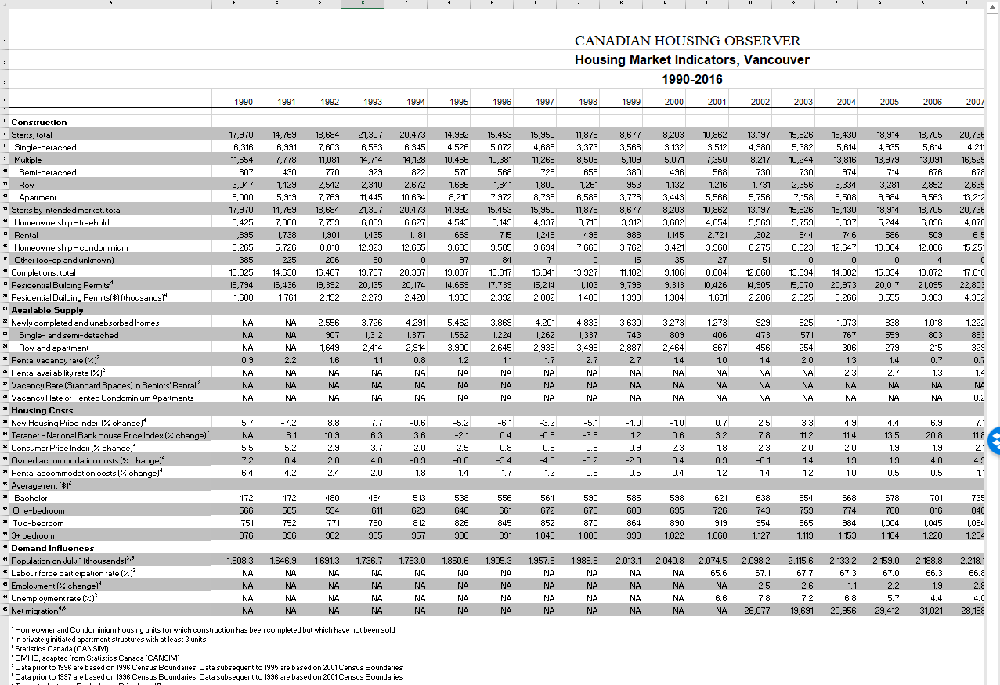
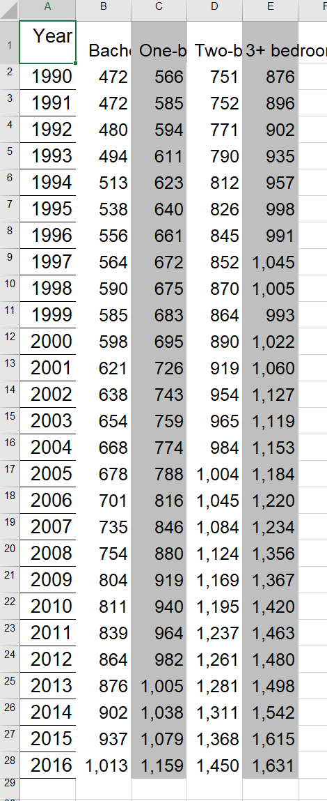
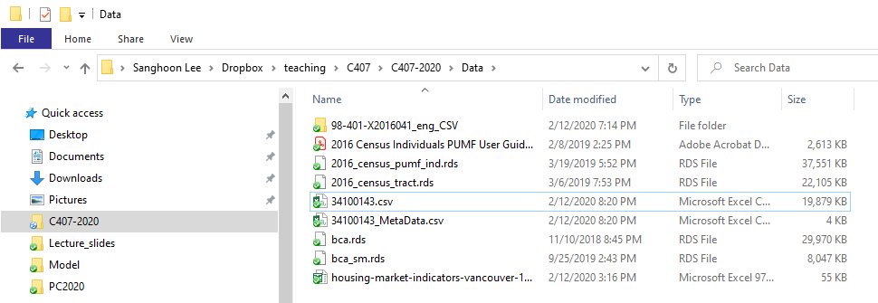
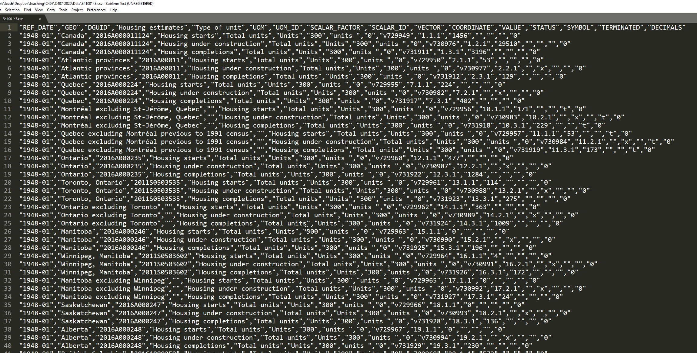

```{r setup, include=FALSE}
knitr::opts_chunk$set(echo = TRUE, warning = FALSE, message = FALSE, comment=NA, fig.asp = 0.56, out.width='70%', dpi = 300, fig.align = 'center')
options(tibble.print_max = Inf)
library(kableExtra)
```

readxl::read_excel()

read_csv()

StatCan data

cansim::get_cansim()

gather()

lubridate::ymd()

---

Download and install 'Sublime Text' from https://www.sublimetext.com/

```{r}
library(tidyverse)
```

---

Go to the CMHC website: https://www.cmhc-schl.gc.ca/

Click Data and Research - Data Tables - Housing Market Indicators.

Choose Vancouver.

Click Download.

Save the file 'housing-market-indicators-vancouver-1990-2016.xls' into the data folder.

---

Open the file in Excel and inspect the contents.

Suppose you want to import the following into R: Average rent for Bachelor, One-bedroom, Two-bedroom, and three+ bedrooms by year.

---




---

Create a new sheet - Sheet2 - in Excel. (You have to enable Editing.)

Copy and paste the four corresponding *rows* on Sheet1 into *columns* on Sheet2. (You will have to use 'Transpose' paste.)

Copy and paste the years as a column.

Add column name for year.

---



---

.small[
```{r}
rents <- readxl::read_excel(
  'Data/housing-market-indicators-vancouver-1990-2016.xls', 
  sheet = "Sheet2")
```
]

---

```{r}
ggplot(rents) + geom_line(aes(Year, Bachelor))
```

---

```{r}
ggplot(rents) + geom_line(aes(Year, `One-bedroom`))
```

---

```{r}
rents_long <- rents %>% gather(key="Type", value="Rent", -Year)
```

```{r}
rents_long
```

---

.tiny[
```{r}
wide <- rents %>% head(2)
```
]

.pull-left-2[
.tiny[
```{r}
wide
```
]]

.pull-right-1[
.tiny[
```{r}
wide %>% gather(
  key="Type", 
  value="Rent",
  -Year)
```
]]

---

```{r}
ggplot(rents_long, aes(Year, Rent, color=Type)) + 
  geom_line() + geom_point()
```

---

```{r}
rents_long <- rents_long %>% 
  group_by(Type) %>% 
  mutate(Rent_1990 = Rent / nth(Rent, 1))
```

.tiny[
```{r}
rents_long
```
]

---

```{r}
ggplot(rents_long, aes(Year, Rent_1990, color=Type)) + 
  geom_line() + geom_point()
```

---

.tiny[
```{r}
rents_long <- rents_long %>% group_by(Type) %>% 
  mutate(Rent_2000 = Rent / nth(Rent, 11))
```
]

.tiny[
```{r}
rents_long
```
]

---

```{r}
ggplot(rents_long, aes(Year, Rent_2000, color=Type)) + 
  geom_line() + geom_point()
```

---

### Statistics Canada Data Table (Formely, CANSIM)

.small[
Go to [Statistics Canada website](https://www12.statcan.gc.ca).

Click Data.
]

--

.small[
Check Construction box and then Housing starts box, in Subject.

Check Census metropolitan area box, in Geography.

Check Monthly, in Frequency.
]

--

.small[
Click 'Canada Mortgage and Housing Corporation, housing starts, under construction and completions in centres 10,000 and over, Canada, provinces, selected census metropolitan areas' - Table number 34-10-0143-01.

Click 'Download Options' button, and then CSV Download entire table... (second from the bottom).

Download '34100143-eng.zip' and extract it to the Data folder.
]

---



---

Open 34100143.csv using the Sublime Text, and confirm that variables are separated by comma (hence CSV).



---

```{r}
starts <- read_csv("Data/34100143.csv")
```

```{r eval=FALSE}
starts %>% View
```

---

.scroll-output[
```{r echo=FALSE}
starts %>% head(20) %>% kable
```
]

---

### cansim package

```{r}
library(cansim)
```

```{r cache=TRUE}
starts_2 <- get_cansim("34-10-0143-01")
```

```{r eval=FALSE}
starts_2 %>% View
```

---

.scroll-output[
```{r echo=FALSE}
starts_2 %>% head(20) %>% kable
```
]

---

.small[
```{r}
van_starts <- starts_2 %>% 
  filter( DGUID == "2011S0503933" ) %>% 
  transmute(date=lubridate::ymd(REF_DATE, truncated = 1), 
            GEO, `Housing estimates`, VALUE)
```
]

---

ymd() converts character vector to a date vector.

```{r}
input <- c("2012-2-1", "2020-2-3")
input %>% class()
```
```{r}
output <- lubridate::ymd(input)
output
```

```{r}
output %>% class()
```

---

We used 'truncated = 1' because REF_DATE column is missing day.

```{r}
lubridate::ymd(c("2012-2", "2020-2"), truncated = 1)
```

```{r}
lubridate::ymd(c("2012", "2020"), truncated = 2)
```

---

.small[
```{r}
van_starts
```
]

---

.small[
```{r}
van_starts %>% 
  ggplot() + geom_line(aes(date, VALUE, color=`Housing estimates`))
```
]

---

.small[
```{r}
van_starts %>% filter(`Housing estimates` != "Housing under construction") %>% 
  ggplot() + geom_line(aes(date, VALUE, color=`Housing estimates`))
```
]

---

.tiny[
```{r}
van_starts %>% filter(
  `Housing estimates` != "Housing under construction",
  date>=lubridate::ymd(2012, truncated = 2)) %>% 
  ggplot(aes(date, VALUE, color=`Housing estimates`)) + geom_line() + geom_smooth()
```
]

