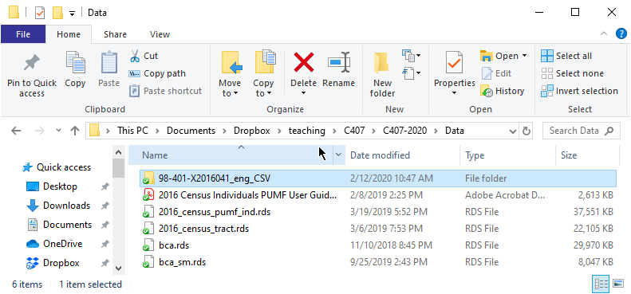
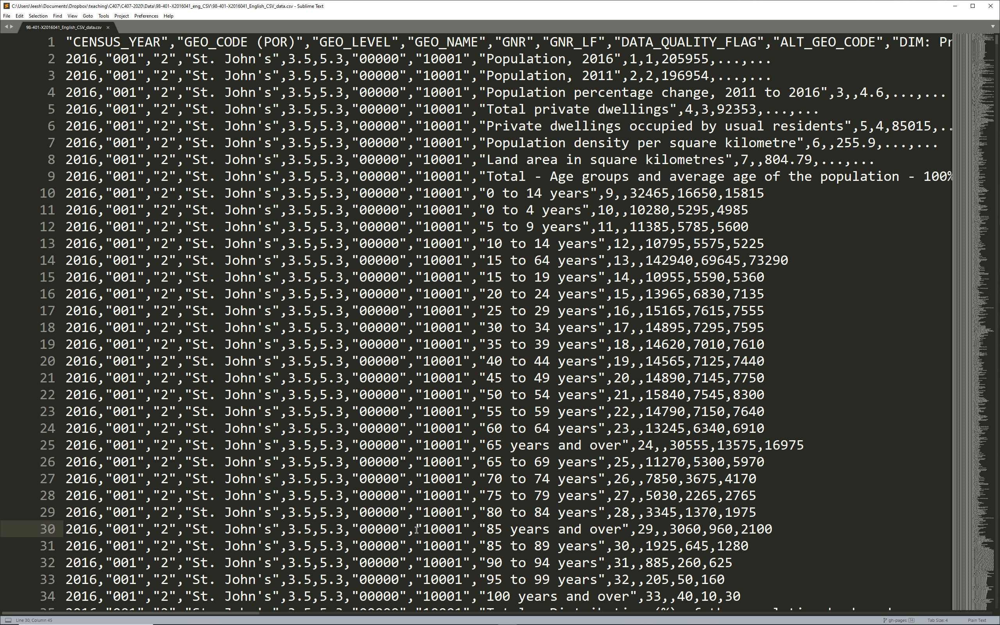

```{r setup, include=FALSE}
knitr::opts_chunk$set(echo = TRUE, warning = FALSE, message = FALSE, comment=NA, fig.asp = 0.56, out.width='70%', dpi = 300, fig.align = 'center')
options(tibble.print_max = Inf)
library(kableExtra)
```

### Census profile

Go to [Statistics Canada website](https://www12.statcan.gc.ca).

Click Census - Data products - Census Profile

--

Click View 'Canada' in the Browse box.

You can see all the list of variables available for the whole Canada.

The same set of variables are available for smaller geographic units such as CMA or Census tracts.

---

Suppose we are interested in studying homeownership rates across CMAs, and how it is related to housing value and city size.

--

Click Download Census Profile Data

It shows differnet file formats across various geographic levels.

--

Click CSV in 'Census metropolitan areas (CMAs) and census agglomerations (CAs)'.

Extract the file into the 'Data' folder.

---



---

Open "98-401-X2016041_English_CSV_data.csv" in Sublime Text and confirm that it is in CSV format:



---

```{r}
library(tidyverse)
```

.small[
```{r}
profile <- read_csv(
  "Data/98-401-X2016041_eng_CSV/98-401-X2016041_English_CSV_data.csv"
  )
```

```{r eval=FALSE}
profile %>% View
```
]

---

.scroll-output[
.small[
```{r echo=FALSE}
profile %>% head(200) %>% kable
```
]]

---

Recall we are interested in studying homeownership rates across CMAs, and how it is related to housing value and city size.

Identify relevant data items from the table for whole Canada at the StatCan website:

--

- Population, 2016
- Total - Private households by tenure - 25% sample data
- Owner
- Median value of dwellings ($)

We need to find their 'Member IDs'.

---

```{r}
members <- profile %>% 
  select(`DIM: Profile of Census Metropolitan Areas/Census Agglomerations (2247)`, 
         `Member ID: Profile of Census Metropolitan Areas/Census Agglomerations (2247)`) %>% 
  unique()
```

```{r eval=FALSE}
members %>% View
```

---

.scroll-output[
.tiny[
```{r echo=FALSE}
members %>% kable()
```
]]

---

- Population, 2016
- Total - Private households by tenure - 25% sample data
- Owner
- Median value of dwellings ($)

Corresponding member IDs are 1, 1617, 1618, 1676

---

.tiny[
```{r}
tb <- profile %>% filter(
  `Member ID: Profile of Census Metropolitan Areas/Census Agglomerations (2247)` %in% c(1, 1617, 1618, 1676))
```
]

```{r eval=FALSE}
tb %>% View
```

---

.scroll-output[
.tiny[
```{r echo=FALSE}
tb %>% head(200) %>% kable()
```
]]

---

```{r}
tb <- tb %>% select(
  GEO_NAME, 
  item=`DIM: Profile of Census Metropolitan Areas/Census Agglomerations (2247)`, 
  n =`Dim: Sex (3): Member ID: [1]: Total - Sex`)
```


```{r eval=FALSE}
tb %>% View
```

---

.scroll-output[
.tiny[
```{r echo=FALSE}
tb %>% kable()
```
]]

---

```{r}
tb2 <- tb %>% spread(key=item, value=n)
```

```{r eval=FALSE}
tb2 %>% View
```

---

.scroll-output[
.tiny[
```{r echo=FALSE}
tb2 %>% kable()
```
]]

---

.tiny[
```{r}
tb3 <- tb2 %>% transmute(
  GEO_NAME, 
  `Median value of dwellings ($)`, 
  `Population, 2016`, 
  Owner_share = Owner / `Total - Private households by tenure - 25% sample data`)
```
]

```{r eval=FALSE}
tb3 %>% View
```

---

.scroll-output[
.tiny[
```{r echo=FALSE}
tb3 %>% kable()
```
]]

---

```{r}
tb3 %>% 
  ggplot(aes(`Population, 2016`, Owner_share)) + 
  geom_point() + geom_smooth()
```


---

.small[
```{r}
tb3_lbl <- tb3 %>% filter(`Population, 2016`>1000000)

tb3 %>% 
ggplot(aes(`Population, 2016`, Owner_share)) + 
  geom_point() + geom_smooth() + 
  ggrepel::geom_text_repel(aes(label=GEO_NAME), tb3_lbl)+
  scale_x_log10()
```
]

---

```{r}
tb3 %>% 
  ggplot(aes(`Median value of dwellings ($)`, Owner_share)) + 
  geom_point(aes(size= `Population, 2016`)) + geom_smooth() + 
  ggrepel::geom_text_repel(aes(label=GEO_NAME), tb3_lbl)+
  scale_x_log10() + scale_size_continuous(guide=FALSE)
```
