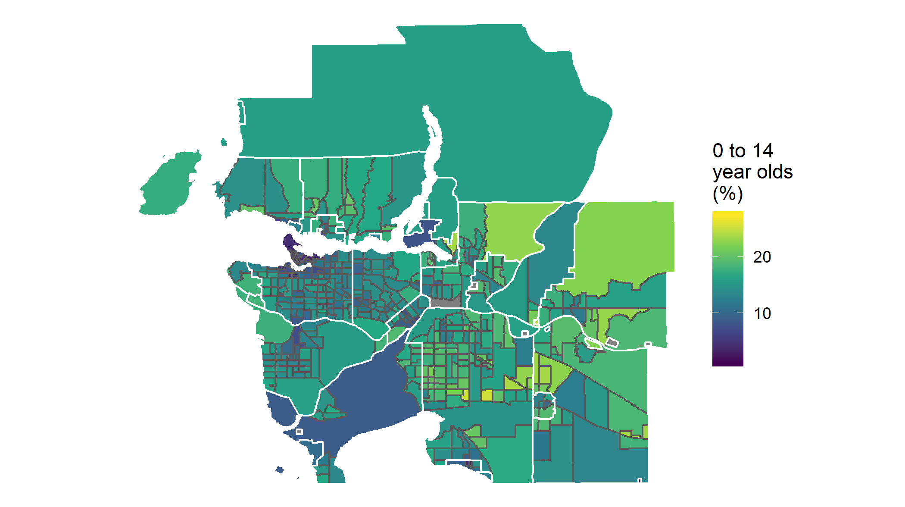

```{r setup, include=FALSE}
knitr::opts_chunk$set(echo = TRUE, warning = FALSE, message = FALSE, comment=NA, fig.asp = 0.56, out.width='70%', dpi = 300, fig.align = 'center')
options(tibble.print_max = Inf)
library(kableExtra)
```

.small[
Create a Vancouver CMA map showing the percentage of 0 to 14 year olds among all population by census tract, and save the map as "children_share.png".
]



---

```{r}
library(sf)
library(tidyverse)
```

```{r}
census_tract_van <- read_rds("Data/census_tract_van.rds")
ct_bndry_van <- read_rds("Data/ct_bndry_van.rds")
csd_bndry_van <- read_rds("Data/csd_bndry_van.rds")
```

---

```{r}
census_tract_van %>% filter(
  `DIM: Profile of Census Tracts (2247)` %>% str_detect("0 to 14")
  ) %>% head()
```

---

Member ID is 35. 

The 9 is the number of 0 to 14 year olds and 35 is their

```{r}
tb <- census_tract_van %>% 
  filter(`Member ID: Profile of Census Tracts (2247)` == 35) %>% 
  select(-`Member ID: Profile of Census Tracts (2247)`, 
         -`Dim: Sex (3): Member ID: [2]: Male`, 
         -`Dim: Sex (3): Member ID: [3]: Female`)
```

---

```{r}
tb <- tb %>% spread(
  key=`DIM: Profile of Census Tracts (2247)`, 
  value = `Dim: Sex (3): Member ID: [1]: Total - Sex`)
```

```{r}
tb <- tb %>% mutate(`0 to 14 years` = as.numeric(`0 to 14 years`))
```

```{r}
tb_sf <- ct_bndry_van %>% left_join(tb, by=c("CTUID"= "GEO_CODE (POR)"))
```

---

```{r final_map}
ggplot(tb_sf) + geom_sf(aes(fill = `0 to 14 years`)) +
  geom_sf(data=csd_bndry_van, color="white", fill=NA) +
  scale_fill_viridis_c("0 to 14\nyear olds\n(%)") +
  coord_sf(crs=4326) + theme_void()
```

---

```{r echo=FALSE}
ggsave("Lecture_slides/19_children_share.png")
```

```{r eval=FALSE}
ggsave("children_share.png")
```
