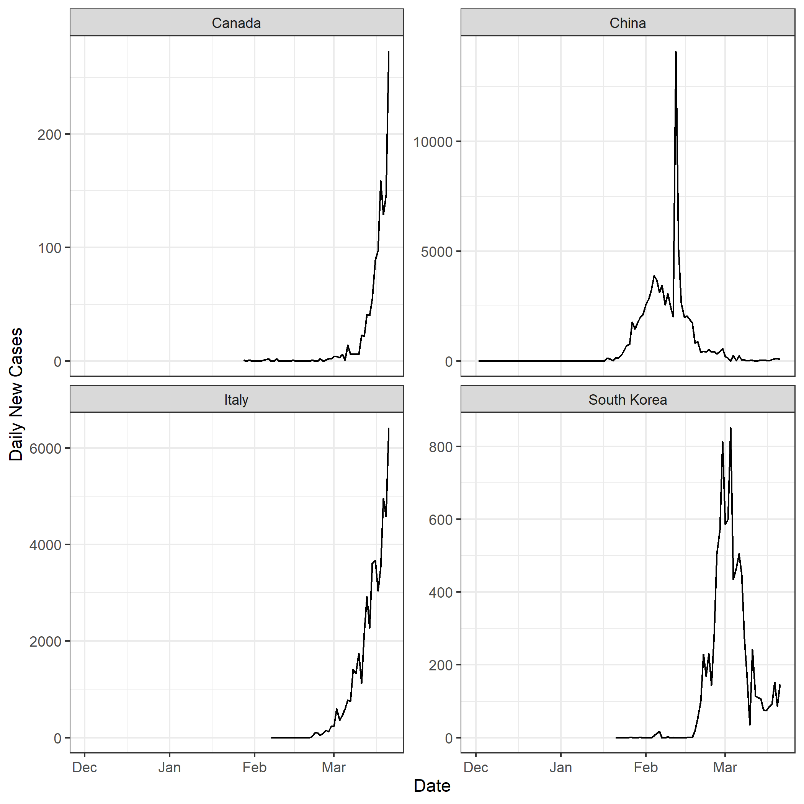
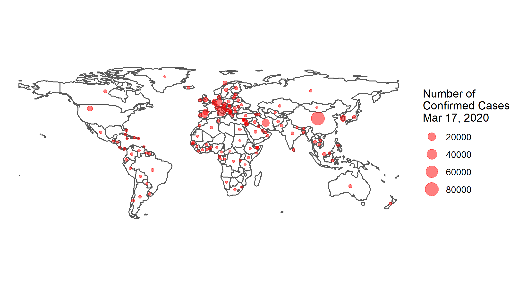

```{r setup, include=FALSE}
knitr::opts_chunk$set(echo = TRUE, warning = FALSE, message = FALSE, comment=NA, fig.asp = 0.56, out.width='70%', dpi = 300, fig.align = 'center')
options(tibble.print_max = Inf, width = 10000)
library(kableExtra)
set.seed(0)
```



---




---

**Package installation**

.small[
```{r eval=FALSE}
install.packages("remotes")
remotes::install_github("GuangchuangYu/nCov2019")
```
]

.small[
Choose 2 to:
]
.tiny[
These packages have more recent versions available.
It is recommended to update all of them.
Which would you like to update?

1: All                         
2: CRAN packages only          
3: None       
]

.small[
Click No to 
]
.tiny[
Do you want to install from sources the package which needs compilation?
]

.small[
For other error messages (e.g., cannot remove prior installation of package ...), restart RStudio and try again. (Repeat this step if necessary.)
]

---

```{r eval=FALSE}
install.packages("rnaturalearth")
```

```{r eval=FALSE}
install.packages("rgeos")
```

```{r eval=FALSE}
install.packages("countrycode")
```

---

```{r}
library(nCov2019)
library(tidyverse)
```

```{r}
nCov <- load_nCov2019()$global
```

```{r eval=FALSE}
nCov %>% View
```

---

.scroll-output[
```{r echo=FALSE}
nCov %>% head(300) %>% kable()
```
]

---

```{r}
nCov %>% filter(country == "China") %>% 
	ggplot(aes(time, cum_confirm)) + geom_line() + geom_point()
```

---

.small[
```{r}
nCov %>% filter(country == "China") %>% 
	mutate(new_confirm = cum_confirm-lag(cum_confirm)) %>% 
	ggplot(aes(time, new_confirm)) + geom_line() + geom_point()
```
]

.small[
See [this page](https://sleeubc.github.io/c407_2020/Lecture_slides/09_dplyr_4.html#9) for lag().
]

---

```{r}
nCov %>% filter(country == "China") %>% 
	mutate(active = cum_confirm - cum_heal - cum_dead) %>% 
	ggplot(aes(time, active)) + geom_line() + geom_point()
```

---

```{r}
nCov %>% filter(country == "Canada") %>% 
	mutate(active = cum_confirm - cum_heal - cum_dead) %>% 
	ggplot(aes(time, active)) + geom_line() + geom_point()
```

---

.small[
```{r}
nCov %>% filter(country %in% c("China", "Italy", "Canada", "South Korea")) %>% 
	mutate(active = cum_confirm - cum_heal - cum_dead) %>% 
	ggplot(aes(time, active, color=country)) + geom_line()
```
]

---

.small[
```{r}
nCov %>% filter(country %in% c("China", "Italy", "Canada", "South Korea")) %>% 
	mutate(active = cum_confirm - cum_heal - cum_dead) %>% 
	ggplot(aes(time, active)) + geom_line() + facet_wrap(~country)
```
]

---

.small[
```{r}
nCov %>% filter(country %in% c("China", "Italy", "Canada", "South Korea")) %>% 
	mutate(active = cum_confirm - cum_heal - cum_dead) %>% 
	ggplot(aes(time, active)) + geom_line() + facet_wrap(~country, scales = "free")
```
]

---

.small[
```{r}
nCov %>% filter(country %in% c("China", "Italy", "Canada", "South Korea")) %>% 
	mutate(active = cum_confirm - cum_heal - cum_dead) %>% 
	ggplot(aes(time, active)) + geom_line() + facet_wrap(~country, scales = "free_y")
```
]

---

.small[
```{r}
nCov %>% filter(country %in% c("China", "Italy", "Canada", "South Korea")) %>% 
	group_by(country) %>% 
	mutate(new_confirm = cum_confirm - lag(cum_confirm)) %>% 
	ggplot(aes(time, new_confirm)) + geom_line() + 
	facet_wrap(~country, scales = "free_y")
```
]

---

.small[
```{r}
nCov %>% filter(country %in% c("China", "Italy", "Canada", "South Korea")) %>% 
	group_by(country) %>% 
	mutate(new_confirm = cum_confirm - lag(cum_confirm)) %>% 
	ggplot(aes(time, new_confirm)) + geom_line( ) + 
	facet_wrap(~country, scales = "free_y") + 
	labs(x="Date", y="Daily New Cases") + theme_bw() 
```
]

---

```{r eval=FALSE}
ggsave("Cov_fig.png")
```

```{r echo=FALSE}
ggsave("Lecture_slides/22_Cov_fig.png")
```

---

### Mapping COVID-19

```{r}
library(rnaturalearth)
library(sf)
```

```{r}
world_map <- ne_countries(returnclass = "sf") 
```

---

.scroll-output[
.tiny[
```{r}
world_map
```
]]

---

```{r}
world_map <- world_map %>% select(name, iso_a3)
```
.tiny[
```{r}
world_map
```
]

---

```{r}
world_map %>% ggplot() + geom_sf()
```

---

.small[
```{r}
world_map <- world_map %>% filter(name != "Antarctica")

world_map %>% ggplot() + geom_sf()
```
]

---

.small[
```{r}
library(countrycode)

nCov <- nCov %>% mutate(
	iso3c=countrycode(country, origin = "country.name", destination = "iso3c")
	)
```
]

.small[
```{r}
nCov %>% head()
```
]

---

```{r}
nCov_now <- nCov %>% filter(time == lubridate::ymd("2020-03-17"))
```

.small[
```{r}
nCov_now %>% head()
```
]

---

```{r}
classify <- function(x, n, style="equal", num_format=scales::comma_format()) {

	require(BAMMtools)
	require(scales)

	breaks_cut <- switch( style,
		equal=seq(min(x, na.rm = TRUE), max(x, na.rm = TRUE), length.out = n+1 ),
		jenks = getJenksBreaks( x, n+1),
		quantile = quantile(x, probs = seq(0, 1, 1/n), na.rm=TRUE)
		)

	labels_cut <- paste( num_format(breaks_cut)[-length(breaks_cut)], num_format(lead(breaks_cut)[-length(breaks_cut)]), sep=" - ")

	cut( x, breaks= breaks_cut, labels=labels_cut )
}
```


```{r}
world_map %>% left_join(nCov_now, by=c("iso_a3"="iso3c")) %>% 
	ggplot() + geom_sf( aes(fill= classify(cum_confirm, 6, "jenks" ) ) ) + scale_fill_viridis_d("# confirmed")
```

---

```{r}
country_pts <- world_map %>% st_centroid()
```

```{r}
ggplot() + geom_sf(data=world_map) + 
	geom_sf(data=country_pts, color="red")
```

---

```{r}
country_pts
```

---

.small[
```{r}
country_pts <- country_pts %>% left_join(nCov_now, by=c("iso_a3"="iso3c"))
```
]

.tiny[
```{r}
country_pts
```
]

---

.tiny[
```{r}
ggplot() + geom_sf(data=world_map, fill=NA) + 
	geom_sf(aes(size=cum_confirm), data = country_pts, color="red", alpha=0.5) + 
	scale_size_continuous("Number of\nConfirmed Cases\nMar 17, 2020") +
	theme_void()
```
]

---

```{r eval=FALSE}
ggsave("Cov_map.png")
```

```{r echo=FALSE}
ggsave("Lecture_slides/22_Cov_map.png")
```

