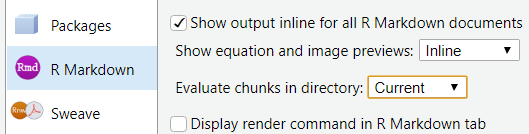
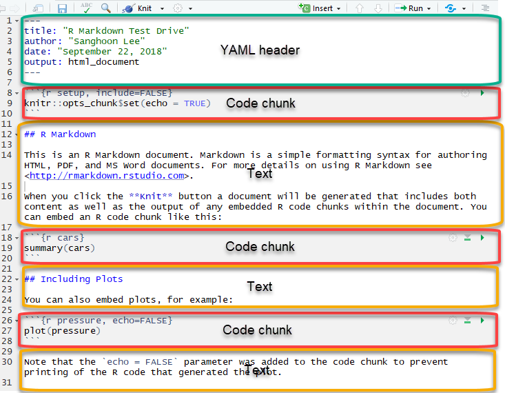
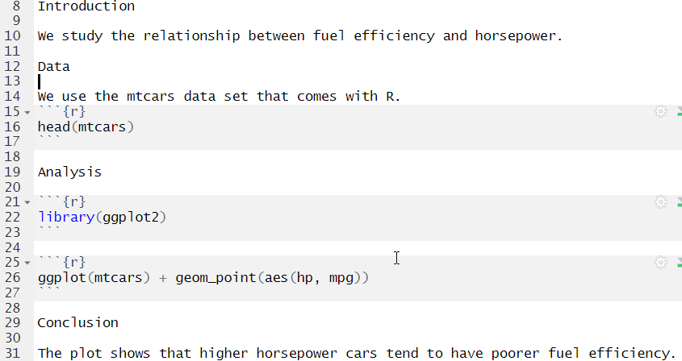
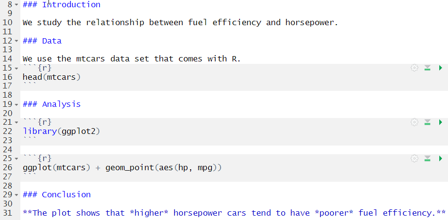
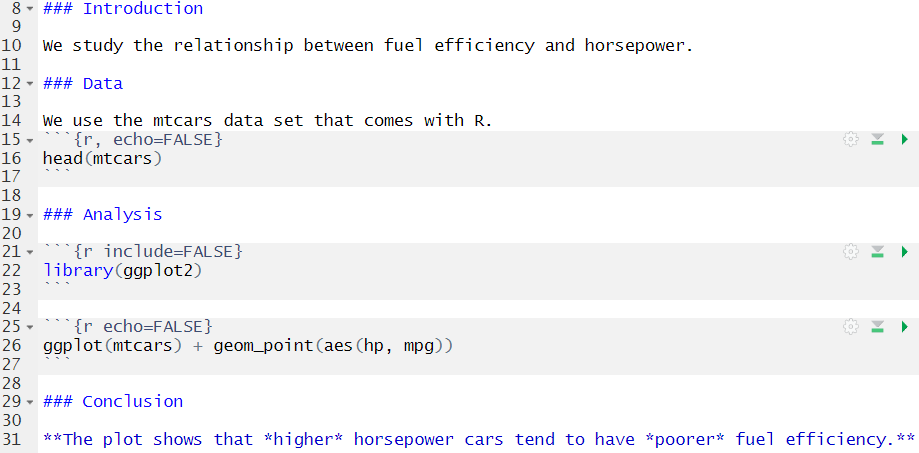
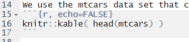
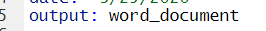

```{r setup, include=FALSE}
knitr::opts_chunk$set(echo = TRUE, warning = FALSE, message = FALSE, comment=NA, fig.asp = 0.56, out.width='70%', dpi = 300, fig.align = 'center')
options(tibble.print_max = Inf)
library(kableExtra)
library(knitr)
set.seed(0)
```


### Console, R Script, and R Markdown

- Console for the codes you do not want to keep. (e.g., install.packages())

- R Script for the codes you want to keep.

- R Markdown allows you to write text, codes, and output in one document. 

  - Convenient when you write a report based on your R analysis. 
  
  - For example, if you change an intermediate step in your analysis, all you have to do is to knit your R Markdown code into a document again.

---

### Setting up

In R Studio, go to Tools - Global Options - R Markdown. Set 'Evaluate chunks in directory' to 'Current'.

```{r echo=FALSE}

```

--

Start your session by opening the C407 project file.

---

### Test Drive

- Click 'File - New File - R Markdown'. 

- Type "Fuel Efficiency vs. Horsepower" in Title box.

- Type your name in Author box.

- Click OK. RStudio will generate a RMarkdown template you can revise.

- Save the file as Fuel_efficiency_vs_Horsepower.Rmd

---

```{r echo=FALSE}

```

---
.small[Delete everything below 'YAML header' (from line 8) and add the following:]

```{r echo=FALSE}

```

.small[
- Creak a blank code chunk by pressing **ctrl/cmd-alt-i**.
- At the end of each line in a code chunk, press **ctrl/cmd-enter** to execute the line.
- Generate the whole document by clicking the **Knit** button or press **ctrl/command-shft-k**.
]

---

### Text Formatting

.small[Revise the Rmd program as follows and `knit` the document.]

```{r echo=FALSE}

```

.small[For more formatting options, see Pandoc's Markdown section of **R Markdown Cheat Sheet** in Help - Cheatsheets in RStudio.]

---

### Code Chunk Options

<!--
- To hide code chunks and show only their output, use **echo=FALSE** chunk option.
- To show only code while not evaluating it (thus showing no output), use **eval=FALSE** chunk options.
-->

.small[Revise the Rmd program as follows and `knit` the document.]

```{r echo=FALSE}

```

.small[For more chunk options, see *Important Chunk Options* section of the **R Markdown Cheat Sheet**.]

---

### Table format

.small[Revise the Rmd program as follows and `knit` the document.]

```{r echo=FALSE}

```

---

### Output Format

Note **output: html_document** in YAML header. When you knit it, you obtain a html file as its output.

You can choose a different output format (e.g., pdf, word) by modifying the line.

Change *output: html_document* to *output: word_document*, and knit it. 

```{r echo=FALSE}

```

It will create Fuel_efficiency_vs_Horsepower.docx file and show it in your MS-Word.
