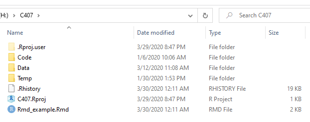
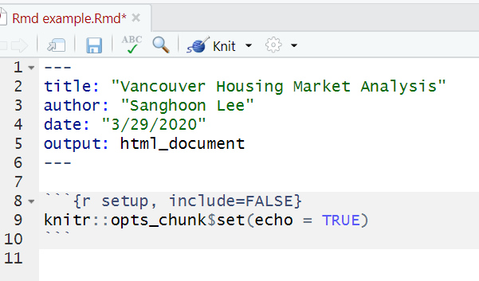
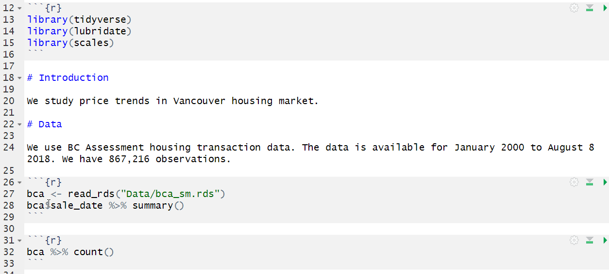
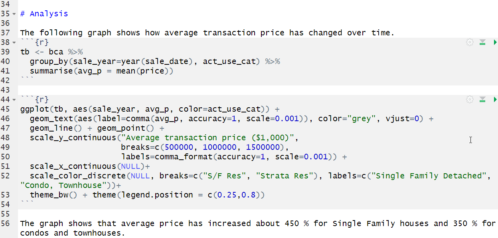
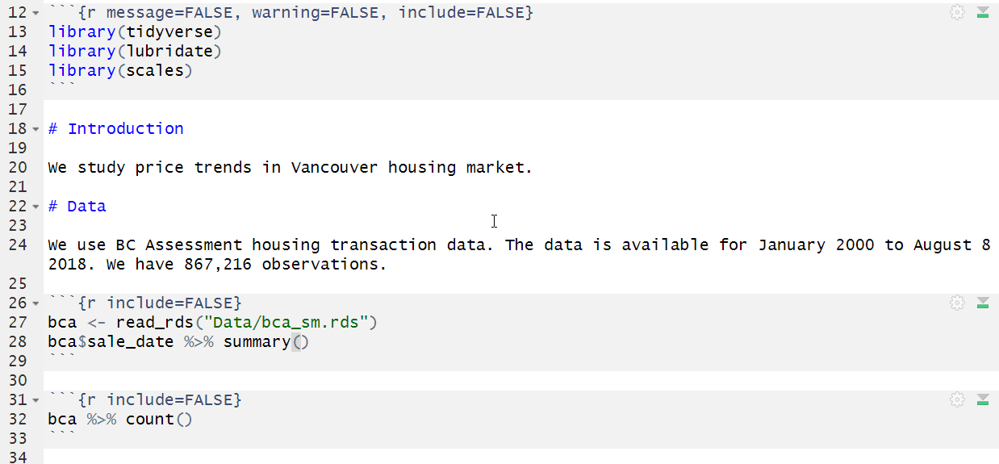
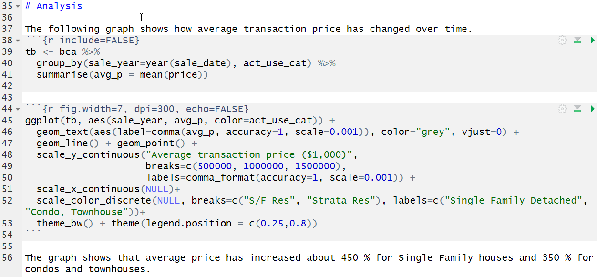
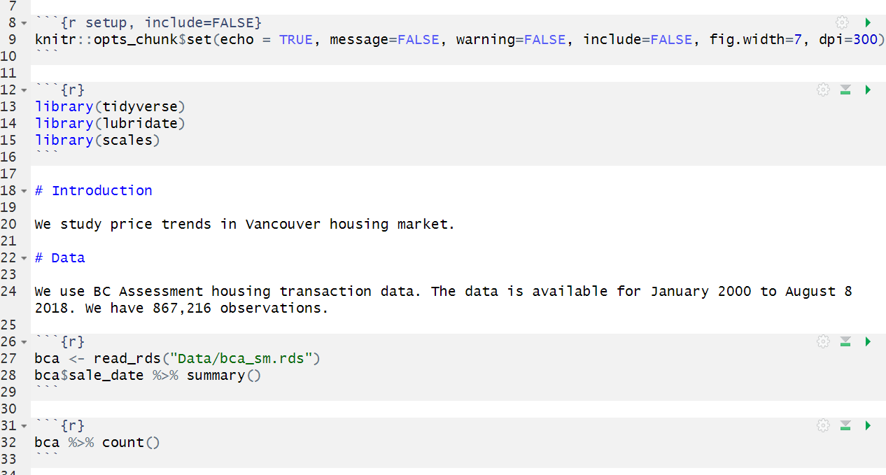
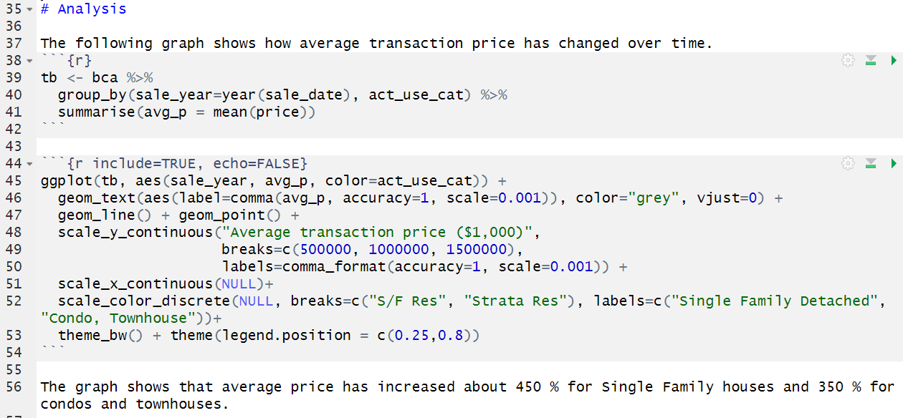

```{r setup, include=FALSE}
knitr::opts_chunk$set(echo = TRUE, warning = FALSE, message = FALSE, comment=NA, fig.asp = 0.56, out.width='70%', dpi = 300, fig.align = 'center')
options(tibble.print_max = Inf)
library(kableExtra)
library(knitr)
set.seed(0)
```

### Create a template

- Click 'File - New File - R Markdown'. 

- Type "Vancouver Housing Market Analysis" in Title box.

- Type your name in Author box.

- Check 'Word'

- Click OK. RStudio will generate a RMarkdown template you can revise.

- Save the file as Rmd_example.Rmd **in the root of C407 folder** where C407.Rproj file is.

---



---

Delete all from line 11. (Keep lines 8-10.)



---

Type the following and the next. (Make sure to use shortcut keys.)


---



---

[Knit it](24~Rmd_example_1.docx)

---



---



---

[Knit it](24~Rmd_example_2.docx)

---



---



---

[Knit it](24~Rmd_example_FINAL.docx)